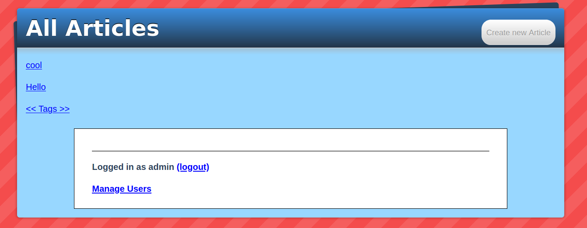
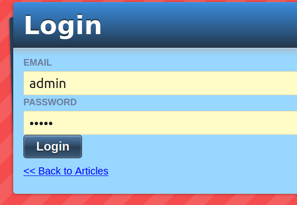
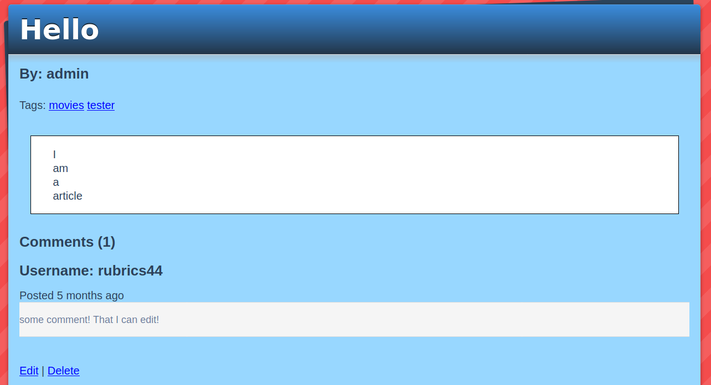
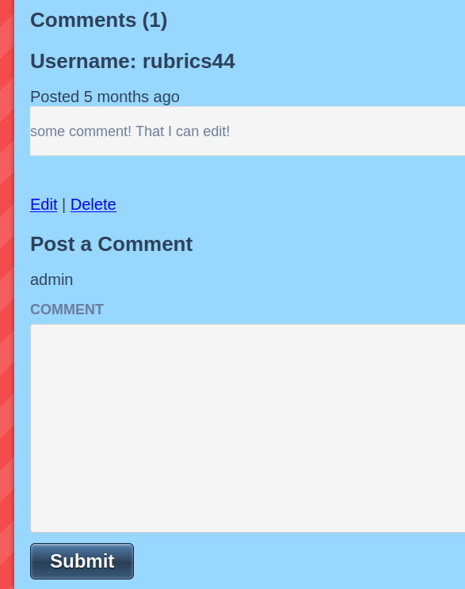
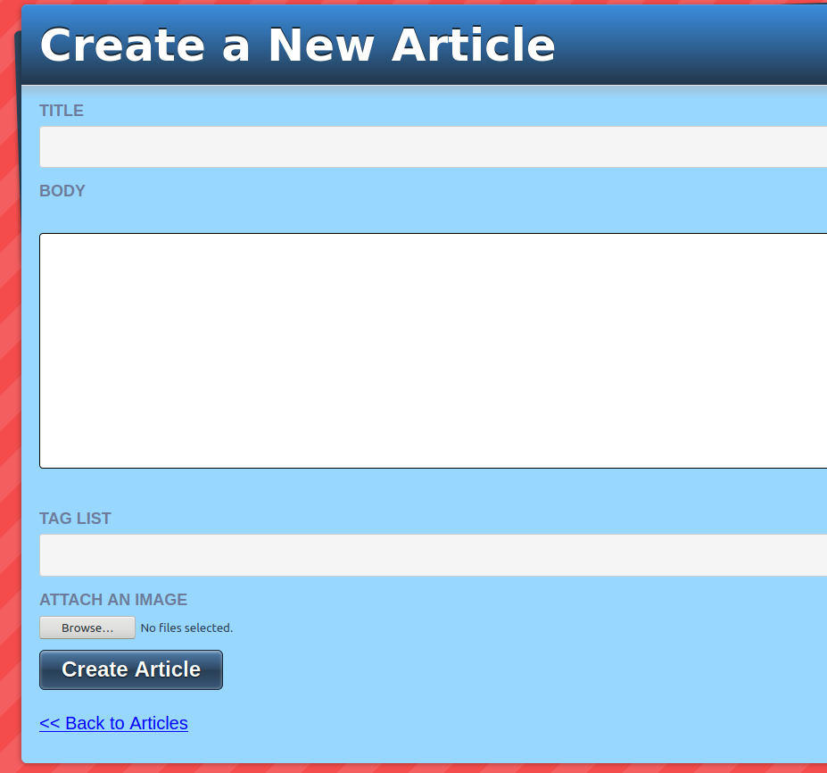
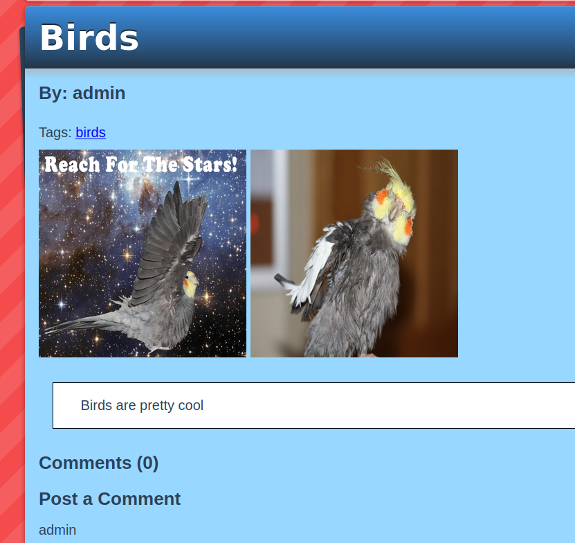
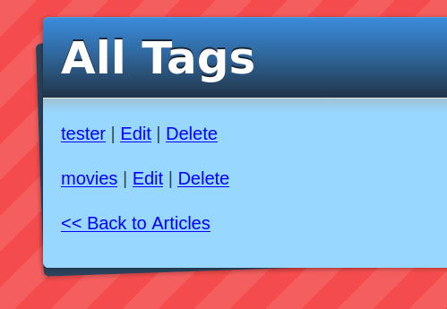
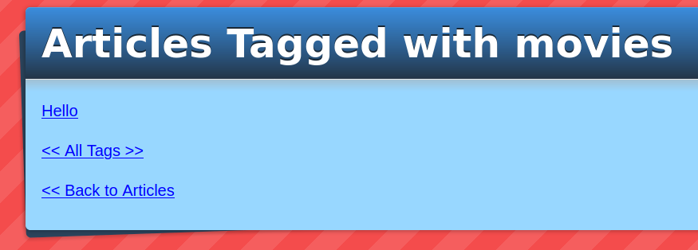
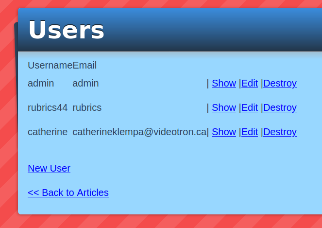

# Ruby on Rails Blog!
> A Blogging Web Application Written for the Odin Project



## Demo

[View The Live Demo](https://andrewbaldwin-rails-blogger.herokuapp.com/)

## About
This app was created following the tutorial on [Jumpstartlab](http://tutorials.jumpstartlab.com/projects/blogger.html).

There were some elements in the tutorial that I didn't really like so I ended up doing things differently in places.

## Features

**_Login or Create an Account_**

<div align='center'>
  
</div><br>

**_View the Articles_**

<div align='center'>
  
</div><br>

**_And Post Your Thoughts_**

<div align='center'>
  
</div><br>

**_Create Your Own Articles_**

<div align='center'>
  
</div><br>

**_And Spruce Them up with Images_**

<div align='center'>
  
</div><br>

**_Find Articles using the Tags_**

<div align='center'>
  
  
</div><br>

**_A Secret Admin Panel Allows Managing User Accounts_**

<div align='center'>
  
</div><br>

**_Articles and Comments Can also be Updated or Deleted!_**

## Deploy the Project

__Clone the repo to your local machine using the terminal__:
```
$ git clone git@github.com:andrewbaldwin44/Ruby_on_Rails_Blog.git
```

__Deploy the Development Server__:
1. Install the dependencies: `bundle install`
2. Start the development server: `bin/rails server`

This will run the app in the development mode.<br />
Open [http://localhost:3000](http://localhost:3000) to view it in the browser.

The page will reload if you make edits.

## Technologies Used

- Ruby
- Ruby On Rails
- CSS
- SASS
- SQL Database
- Active Storage
- minimagick Image Uploading
- sorcery Authentication

## Author

👤 **Andrew Baldwin**

- Github: [@andrewbaldwin44](https://github.com/andrewbaldwin44)
